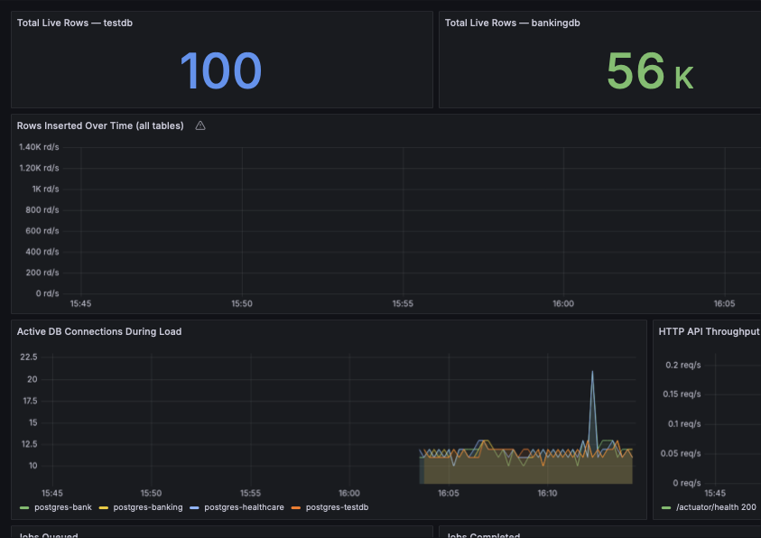
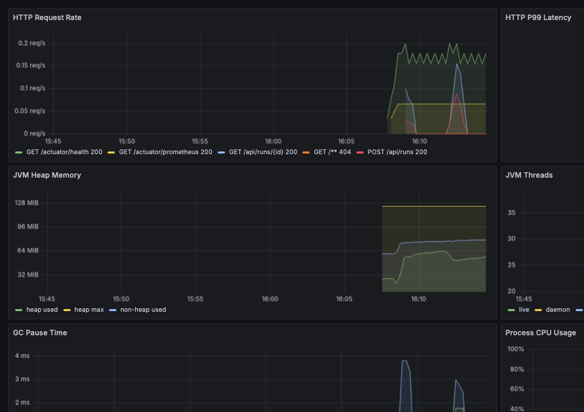
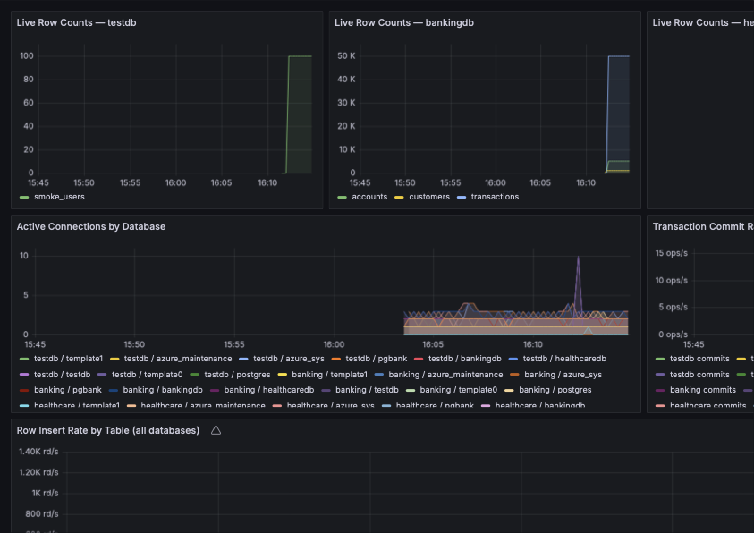
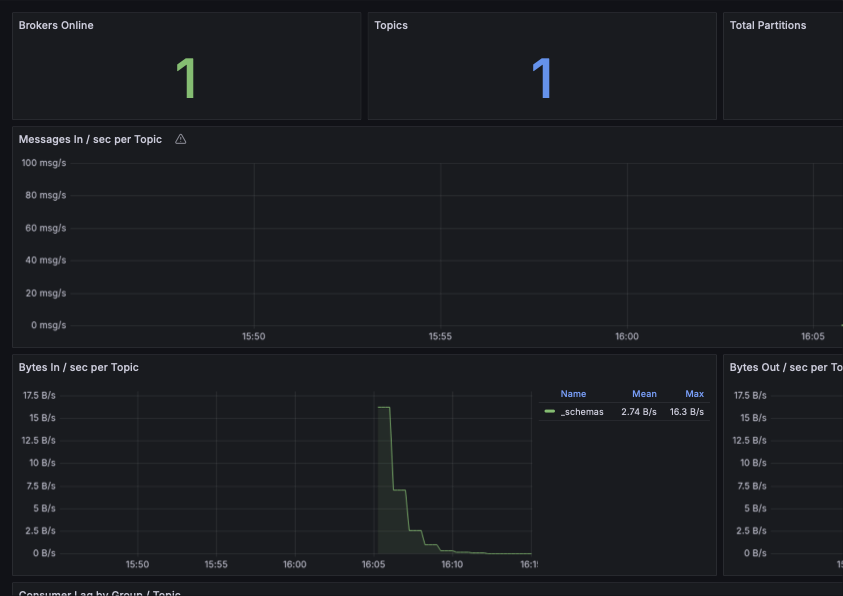

# loadfixtures


A self-contained, enterprise-grade load testing data generator built with Java and Spring Boot. Designed for performance engineers who need to populate realistic, constraint-safe test data into complex schemas — without writing a line of SQL by hand.

---

## What it does

loadfixtures introspects a target database schema at runtime, builds a FK-aware dependency graph, and inserts data in topologically correct order — no constraint violations, no hardcoded table sequences. You point it at a database, fire a REST call, and it works out the rest.

It was built to solve a real problem: performance test environments with complex relational schemas are painful to seed. Most tools either require you to define fixtures manually, ignore foreign key constraints and fail, or only work on simple schemas. loadfixtures handles schemas with hundreds of tables and deep FK chains out of the box.

---

## Key capabilities

- **Schema introspection** — reads `information_schema` at runtime, no configuration files required
- **FK-aware topological load ordering** — resolves dependency graphs across schemas, handles self-referential nullable FKs, multi-column unique constraints, and UUID/string PKs
- **Accumulating sequence offsets** — each run continues from `MAX(pk) + 1`, so row counts grow with every execution rather than silently conflicting
- **REST API** — trigger and monitor load runs via `POST /api/schema/load`, `POST /api/ddl/load`, `POST /api/runs`, `GET /api/runs/{id}`, and `POST /api/consumer/run`
- **Redis-backed queuing** — per-domain work queues, decoupled from the HTTP layer
- **Pluggable DataSink interface** — write to JDBC, CSV, Parquet, or Kafka with the same pipeline
- **Avro serialization for Kafka** — schemas derived at runtime from column definitions, registered automatically with Confluent Schema Registry on first produce
- **Full observability stack** — Prometheus metrics, four Grafana dashboards, Kafka UI, four Postgres exporters, kafka-exporter, JMX exporter
- **Kubernetes-native** — full stack runs on Docker Desktop K8s across four namespaces; survives restarts with no manual intervention
- **Cloud-ready** — deploy the full stack to Azure AKS via Terraform in three commands; secrets managed via Azure Key Vault with workload identity, no credentials in any manifest

---

## Architecture

```
REST API (Spring Boot)
    │
    ▼
Redis (per-domain queues)
    │
    ▼
Schema Introspector → FK Dependency Graph → Topological Sort
    │
    ▼
FakerEngine (data generation per column type)
    │
    ▼
DataSink (JDBC / CSV / Parquet / Kafka)
    │
    ▼
Target Database(s) / Kafka Topic(s)
```

The `SchemaInspector` reads column definitions, PK/FK relationships, and unique constraints from `information_schema`. The dependency graph is resolved via topological sort before any data is generated. The `FakerEngine` maps column types and names to appropriate generated values. Results flow to the configured sink.

---

## Stack

| Component | Technology |
|---|---|
| API | Spring Boot (Java 17) |
| Queue | Redis 7 |
| Data generation | Java Faker |
| Sinks | JDBC, CSV, Apache Parquet, Kafka (Avro) |
| Databases | PostgreSQL 16 |
| Streaming | Apache Kafka 3.7 (KRaft mode) |
| Schema Registry | Confluent Schema Registry 7.6.1 |
| Kafka UI | provectuslabs/kafka-ui |
| Monitoring | Prometheus + Grafana |
| Container orchestration | Docker Compose **or** Kubernetes (Docker Desktop **or** AKS) |
| Infrastructure as code | Terraform (Azure) |
| Secrets management | Azure Key Vault + Workload Identity |

---

## Databases included

Six PostgreSQL instances ship with the stack:

| Instance | Compose port | Purpose |
|---|---|---|
| `testdb` | 5433 | General-purpose smoke test schema |
| `banking` | 5434 | Simplified banking schema (customers → accounts → transactions) |
| `healthcare` | 5435 | Healthcare schema (patients → providers → encounters) |
| `bankschema` | 5436 | 88-table enterprise banking schema (see below) |
| `salesforce` | 5437 | Standard Salesforce CRM object graph — Account/Contact/Lead/Opportunity/OpportunityLineItem/Case/User, real 18-char record Ids (`SF_ID`/`FK_SF_ID`) |
| `salesforceenterprise` | 5438 | 100-table Salesforce schema — real standard objects across Sales/Service/Field Service/Content/Collaboration/Platform/Marketing/Social clouds, same real 18-char record Ids at enterprise scale |

---

## pgbank — 88-table enterprise banking schema

The flagship test schema. Designed to stress-test the FK resolution engine at realistic enterprise scale.

**10 PostgreSQL schemas:** `ref`, `audit`, `party`, `account`, `txn`, `lending`, `card`, `compliance`, `ops`, `wart`

**126 foreign key constraints** across 83 structured tables. The `wart` schema (5 tables, 0 FK constraints) intentionally contains messy, unconstrained tables that simulate legacy data:

- `legacy_account_map` — no primary key
- `card_transaction_flat` — denormalized flat table
- `transaction_staging` — 70-column wide staging table
- `customer_summary` — denormalized customer rollup
- `reporting_cache` — text-based cache table

All domain tables carry `created_at`, `updated_at`, `is_deleted`, and `deleted_at` audit columns.

**Proven results:** 171,007 rows loaded across 88 tables in a single Azure AKS run, 0 worker errors, 0 constraint violations. Row counts accumulate correctly across repeated runs.

### Loading pgbank

**Option 1 — REST API (recommended):** Uses the full Java tool with Redis-backed queuing, Prometheus metrics, and Grafana observability. No schema-specific code required.

```bash
curl -X POST http://localhost:8080/api/schema/load \
  -H "Content-Type: application/json" \
  -d '{"targetDatabase": "bankschema", "schemas": ["ref","party","account","txn","lending","card","compliance","ops","audit","wart"]}'
```

**Option 2 — Standalone script:** `scripts/bank_loader.py` is a self-contained Python alternative that requires only `psycopg2` — no app stack, no Redis, no Docker Compose. Useful for loading pgbank in isolation or in environments where the full stack isn't running.

```bash
pip install psycopg2-binary
python3 scripts/bank_loader.py --rows 100
```

The script is pgbank-specific (hardcoded schemas and seed data for `ref.country` / `ref.currency`). For any other schema, use the REST API — it introspects the schema at runtime and requires no configuration.

---

## Getting started — Docker Compose

### Prerequisites

- **Docker Desktop** — [https://www.docker.com/products/docker-desktop](https://www.docker.com/products/docker-desktop)
  > ⚠️ **Important:** The full stack is memory-intensive. Increase Docker Desktop's memory allocation to at least **6GB** (8GB recommended): Docker Desktop → Settings → Resources → Memory.

### 1. Clone and configure

```bash
git clone https://github.com/nullhypothesis7/loadfixtures.git
cd loadfixtures
cp env.example .env
```

Open `.env` and set passwords for each database instance. The defaults in `env.example` work for local development.

### 2. Start the stack

```bash
docker compose up -d
docker compose ps   # all services should reach 'healthy' within 30-60s
```

This also builds and starts the app container itself (`testfixtures-app`, port 8080) — there's no separate build/run step. `docker compose ps` won't show a health status for it (no healthcheck is defined), so give it a few seconds after the databases go healthy before firing requests; `curl http://localhost:8080/actuator/health` returning `{"status":"UP"}` means it's ready.

### 3. Fire a load run

```bash
# Produce the full enterprise banking schema (88 tables) as Avro messages to Kafka
curl -X POST http://localhost:8080/api/schema/load \
  -H "Content-Type: application/json" \
  -d '{"targetDatabase": "bankschema", "targetType": "KAFKA", "schemas": ["ref","party","account","txn","lending","card","compliance","ops","audit","wart"]}'

# Load a simple schema (direct JDBC)
curl -X POST http://localhost:8080/api/schema/load \
  -H "Content-Type: application/json" \
  -d '{"targetDatabase": "banking", "schemas": ["public"]}'

# Load the Salesforce CRM schema (direct JDBC)
curl -X POST http://localhost:8080/api/schema/load \
  -H "Content-Type: application/json" \
  -d '{"targetDatabase": "salesforce", "schemas": ["salesforce"]}'

# Load the 100-table Salesforce enterprise schema (direct JDBC)
curl -X POST http://localhost:8080/api/schema/load \
  -H "Content-Type: application/json" \
  -d '{"targetDatabase": "salesforceenterprise", "schemas": ["sf_core","sf_account","sf_sales","sf_service","sf_field_service","sf_activity","sf_content","sf_collab","sf_process","sf_marketing","sf_platform","sf_social","sf_assets","sf_messaging"]}'

# Fire a named pipe (e.g. Kafka)
curl -X POST http://localhost:8080/api/runs \
  -H "Content-Type: application/json" \
  -d '{"pipeName": "kafka-test"}'

# Check run status
curl http://localhost:8080/api/runs/{run-id}

# Consume from Kafka topics → write into target schema (FK-ordered).
# Give the producer runs above a few seconds to drain the queue first —
# consumer/run only finds data for topics that have already been produced to.
curl -X POST http://localhost:8080/api/consumer/run \
  -H "Content-Type: application/json" \
  -d '{"targetDatabase": "bankschema", "schemas": ["ref","party","account","txn","lending","card","compliance","ops","audit","wart"]}'
```

### Monitor results

| Dashboard | URL |
|---|---|
| Grafana | http://localhost:3000 |
| Prometheus | http://localhost:9090 |
| Kafka UI | http://localhost:8090 |
| Schema Registry | http://localhost:8081/subjects |

Default Grafana credentials: `admin / admin`

---

## Getting started — Kubernetes (Docker Desktop)

All manifests live in `k8s/` and are organized into four namespaces.

### Prerequisites

- Docker Desktop with Kubernetes enabled (Settings → Kubernetes → Enable Kubernetes)
- `kubectl` context set to `docker-desktop`

```bash
kubectl config use-context docker-desktop
```

### Build the app image

`k8s/app/testfixtures-app.yaml` uses `imagePullPolicy: Never` — it expects the image to already exist locally, it will not pull from a registry. Build it before applying anything else:

```bash
docker build -t testfixtures-app:latest .
```

### Apply the full stack

```bash
# 1. Namespaces first
kubectl apply -f k8s/namespaces.yaml

# 2. Data tier secrets, then workloads
kubectl apply -f k8s/data/secrets.yaml
kubectl apply -f k8s/data/

# 3. Messaging tier
kubectl apply -f k8s/messaging/

# 4. Monitoring tier
kubectl apply -f k8s/monitoring/

# 5. App
kubectl apply -f k8s/app/testfixtures-app.yaml

# 6. nginx ingress controller (one-time per cluster)
kubectl apply -f https://raw.githubusercontent.com/kubernetes/ingress-nginx/controller-v1.10.1/deploy/static/provider/cloud/deploy.yaml
kubectl wait --namespace ingress-nginx --for=condition=ready pod \
  --selector=app.kubernetes.io/component=controller --timeout=120s

# 7. Ingress resources
kubectl apply -f k8s/ingress.yaml
```

### Verify all pods are healthy

```bash
kubectl get pods -A --field-selector=metadata.namespace!=kube-system
```

All pods should reach `1/1 Running`. The stack survives Docker Desktop restarts automatically — K8s recreates everything on startup.

### Access the app and dashboards

Add the following line to `/etc/hosts` (requires sudo):

```
127.0.0.1 app.testfixtures.local grafana.testfixtures.local prometheus.testfixtures.local kafka-ui.testfixtures.local
```

Services are then available directly in your browser — no port-forwarding required:

| Service | URL |
|---|---|
| App API | http://app.testfixtures.local |
| Grafana | http://grafana.testfixtures.local |
| Prometheus | http://prometheus.testfixtures.local |
| Kafka UI | http://kafka-ui.testfixtures.local |

### K8s namespace layout

| Namespace | Contents |
|---|---|
| `testfixtures-data` | postgres-testdb, postgres-banking, postgres-healthcare, postgres-bank, postgres-salesforce, postgres-salesforce-enterprise, redis |
| `testfixtures-messaging` | kafka, schema-registry, kafka-ui, kafka-exporter, kafka-jmx-exporter |
| `testfixtures-monitoring` | prometheus, grafana, grafana-image-renderer, pg-exporter × 6 |
| `testfixtures-app` | testfixtures-app (Spring Boot) |

Cross-namespace connectivity uses full DNS names (`<service>.<namespace>.svc.cluster.local`).

---

## Getting started — Azure (AKS)

The full stack deploys to Azure Kubernetes Service via Terraform. Secrets are managed via Azure Key Vault with workload identity — no credentials appear in any manifest or environment variable.

### Prerequisites

- **Azure CLI** — [https://learn.microsoft.com/en-us/cli/azure/install-azure-cli](https://learn.microsoft.com/en-us/cli/azure/install-azure-cli)
- **Terraform 1.5+** — [https://developer.hashicorp.com/terraform/install](https://developer.hashicorp.com/terraform/install)
- **Docker Desktop** — required only if building a new app image locally (optional if image already exists in ACR)
- An active Azure subscription

### 1. Login and configure

```bash
az login
az account show   # confirm correct subscription

cd terraform
cp terraform.tfvars.example terraform.tfvars
# Edit terraform.tfvars — set subscription_id and pg_admin_password
```

### 2. Deploy infrastructure

```bash
terraform init
terraform plan    # review what will be created (31 resources)
terraform apply   # takes ~15 minutes, AKS provisioning is the long pole
```

Terraform creates: resource group, VNet, AKS cluster (Standard_B2s), Azure Container Registry, Azure PostgreSQL Flexible Server (all 6 databases), Azure Key Vault (7 secrets), managed identity with workload identity federation.

### 3. Build and push the app image

> Skip this step if the image already exists in ACR from a previous deployment.

```bash
./scripts/acr-build.sh          # uses 'latest' tag
./scripts/acr-build.sh abc1234  # use a specific git SHA
```

Docker Desktop must be running for this step.

### 4. Deploy the full stack to AKS

```bash
./scripts/azure-deploy.sh
```

This applies all manifests in dependency order: namespaces → Redis + Kafka → SecretProviderClass + app → monitoring stack → nginx ingress controller → Ingress resources. Waits for rollout completion and prints service URLs at the end.

### 5. Access the app and dashboards

No port-forwarding required. `azure-deploy.sh` installs the nginx ingress controller, waits for the Azure LoadBalancer IP, and prints the live URLs. They follow the pattern:

| Service | URL |
|---|---|
| App API | `http://app.<INGRESS_IP>.nip.io` |
| Grafana | `http://grafana.<INGRESS_IP>.nip.io` |
| Prometheus | `http://prometheus.<INGRESS_IP>.nip.io` |
| Kafka UI | `http://kafka-ui.<INGRESS_IP>.nip.io` |

`nip.io` is a public wildcard DNS service that resolves `*.{IP}.nip.io` to `{IP}` — no DNS registration required.

### 6. Tear down — stops all billing

```bash
terraform destroy
```

All Azure resources are permanently deleted. Nothing persists after destroy. Re-running `terraform apply` creates a fresh environment with new resource names.

### Azure security model

Pods authenticate to Key Vault via Azure Workload Identity — no passwords in pod specs, no mounted secrets files, no environment variables containing credentials. The AKS OIDC issuer binds the Kubernetes service account to an Azure managed identity, which has Key Vault Secrets User role. The Key Vault CSI driver mounts secrets as files at runtime.

### Estimated cost

A full deploy-test-destroy cycle takes approximately 30-45 minutes and costs under $0.25 at current Azure pricing (Standard_B2s AKS node + B1ms PostgreSQL + Basic ACR).

---

## Bring your own schema

Everything above uses the six schemas that ship with this repo. None of that is required — the tool works the same way against a schema it has never seen before. Two paths, both zero-code:

- **You already have a live database with the schema deployed** — `POST /api/schema/load`. The tool introspects `information_schema` itself and works out FK order at runtime.
- **You just have a DDL script, no live connection needed to parse it** — `POST /api/ddl/load`. Paste raw `CREATE TABLE` text; the target database still needs to exist for the generated data to land somewhere, but the tool doesn't need to connect to it to understand the schema.

### One-time setup: register your database

The app only accepts a short `targetDatabase` name in API calls (like `"mydb"`) — that name has to be mapped to real connection details via environment variables first. Pick any name; it becomes the lowercase `targetDatabase` key:

```
DB_URL_MYDB=jdbc:postgresql://host:5432/mydb
DB_USER_MYDB=someuser
DB_PASS_MYDB=somepassword
```

`AppConfig` scans for `DB_URL_*`/`DB_USER_*`/`DB_PASS_*` once at startup, so this requires a restart to take effect — it isn't picked up live. Where the three lines go depends on how you're running it:

| Deployment | File to edit | Restart |
|---|---|---|
| Docker Compose | `.env` | `docker compose up -d --force-recreate app` |
| Local K8s | `k8s/app/testfixtures-app.yaml` | `kubectl apply -f k8s/app/testfixtures-app.yaml && kubectl rollout restart deployment/testfixtures-app -n testfixtures-app` |
| Azure AKS | `k8s/azure/deployment.yaml` | reapply via `./scripts/azure-deploy.sh`, or `kubectl rollout restart deployment/testfixtures-app -n testfixtures` |

That's the only infrastructure step. Everything past this point is a single REST call — no Java code, no schema-specific configuration beyond those three lines.

This assumes your database already exists somewhere and you're pointing the tool at it. If you'd rather have Compose/K8s host that database too, that's a separate step — add a new `postgres-*` service (Compose) or StatefulSet (K8s), following the pattern of any of the six that already ship here (`k8s/data/postgres-testdb.yaml` is the smallest to copy from). Not required for the common case.

### Example: a schema the tool has never seen before

A small two-table `orders` schema — not one of the six shipped with this repo:

```sql
CREATE TABLE customers (
    id         BIGSERIAL PRIMARY KEY,
    email      VARCHAR(255) NOT NULL,
    first_name VARCHAR(100),
    last_name  VARCHAR(100),
    created_at TIMESTAMPTZ NOT NULL DEFAULT NOW()
);

CREATE TABLE orders (
    id          BIGSERIAL PRIMARY KEY,
    customer_id BIGINT NOT NULL REFERENCES customers(id),
    total       NUMERIC(10,2) NOT NULL,
    status      VARCHAR(20) NOT NULL,
    ordered_at  TIMESTAMPTZ NOT NULL DEFAULT NOW()
);
```

With `DB_URL_ORDERSDB` (and user/pass) registered per the table above, hand the DDL straight to the app:

```bash
curl -X POST http://localhost:8080/api/ddl/load \
  -H "Content-Type: application/json" \
  -d '{
    "targetDatabase": "ordersdb",
    "ddl": "CREATE TABLE customers (id BIGSERIAL PRIMARY KEY, email VARCHAR(255) NOT NULL, first_name VARCHAR(100), last_name VARCHAR(100), created_at TIMESTAMPTZ NOT NULL DEFAULT NOW()); CREATE TABLE orders (id BIGSERIAL PRIMARY KEY, customer_id BIGINT NOT NULL REFERENCES customers(id), total NUMERIC(10,2) NOT NULL, status VARCHAR(20) NOT NULL, ordered_at TIMESTAMPTZ NOT NULL DEFAULT NOW());"
  }'
```

Column values are inferred from name and type automatically — `email` becomes a real email address, `first_name`/`last_name` become real names, `created_at`/`ordered_at` become realistic past timestamps, and `customer_id` resolves correctly against the FK. None of this schema was configured ahead of time; the inference happens entirely at runtime.

### If the automatic inference gets a column wrong

Rare, but possible — a `status` column with no enum constraint might get generic text instead of one of your actual valid values. `src/main/resources/pipes/*.json` shows the manual pipe-definition format for overriding a specific column's generator. This is an escape hatch for edge cases, not something needed for the common case above.

---

## Avro + Schema Registry

The Kafka sink produces **Avro-encoded messages** using schemas derived at runtime from pipe column definitions. Schemas are registered automatically with Confluent Schema Registry on first produce via `KafkaAvroSerializer`.

- `AvroSchemaBuilder` maps `ColumnDefinition` types to Avro field types
- `SEQUENCE` → `long` (required), `FK_INT`/`RANDOM_INT`/`NULLABLE_FK_INT` → `int` (optional), `BOOLEAN` → `boolean`, everything else → `string`
- Schema Registry URL is configured via `SCHEMA_REGISTRY_URL` env var

Registered schemas are visible at `http://localhost:8081/subjects` (Compose) or via Schema Registry port-forward (K8s/AKS).

---

## Grafana dashboards

Four pre-provisioned dashboards ship with the stack, captured live from AKS after a full E2E run:

### Pipeline Overview
Aggregate view of the load run: total live rows per database, insert rate across all tables over time, active DB connections during load, HTTP API throughput, and job status counters (queued / running / done / failed).



### App Metrics
Spring Boot application internals: HTTP request rate by endpoint and status code, P50/P99 latency, JVM heap vs non-heap memory, live/daemon/peak thread counts, GC pause time by action and cause, and process + system CPU usage.



### Database Metrics
Per-database PostgreSQL telemetry across all six databases: live row counts by table, active connections, transaction commit and rollback rates, row insert rate by table (all databases combined), and dead tuple counts for vacuum pressure monitoring.



### Kafka Metrics
Broker and topic health: brokers online, topic count, total partitions, under-replicated partitions, messages-in per second per topic, bytes-in/out per topic, consumer group lag by group and topic, and partition count per topic.



---

## DataSink interface

Implement `DataSink` to add a new output target:

```java
public interface DataSink {
    // Returns rows actually persisted — not necessarily rows.size(); a sink
    // backed by ON CONFLICT DO NOTHING (or similar) may silently skip some.
    int write(List<Map<String, Object>> rows, PipeDefinition pipe) throws Exception;
}
```

Built-in implementations: `JdbcSink`, `CsvSink`, `ParquetSink`, `KafkaSink`

---

## Azure deployment (AKS + Terraform)

The full stack deploys to Azure Kubernetes Service in three commands. Validated end-to-end: 8/8 pipes passing, 171,007 rows loaded into pgbank across 88 tables, 0 constraint violations, Grafana dashboards live, `terraform destroy` confirmed clean (27 resources).

### Prerequisites

- Azure CLI (`az login` completed)
- Terraform
- Docker (for ACR image build)
- An active Azure subscription

```bash
az account show   # confirm correct subscription
```

### Deploy

```bash
# 1. Build and push the app image to ACR
./scripts/acr-build.sh

# 2. Provision infrastructure (AKS, ACR, Key Vault, PostgreSQL Flexible Server, VNet)
cd terraform && terraform init && terraform apply

# 3. Deploy all Kubernetes workloads
./scripts/azure-deploy.sh [--auto] [IMAGE_TAG]
```

Terraform provisions: AKS (Standard_B2s × 2 nodes), ACR, Azure Key Vault, PostgreSQL Flexible Server (private VNet, B_Standard_B1ms), managed identity with workload identity. All 6 databases run on one Flexible Server. Secrets are stored in Key Vault — no credentials in any manifest.

### Environment lifecycle

Pass a lifecycle flag to `azure-deploy.sh` to control how the environment tears down:

| Flag | Behaviour |
|---|---|
| *(none)* | Manual only — destroy via the GitHub Actions UI when done |
| `--auto` | Destroyed automatically when your test suite signals completion |

The flag tags the Azure resource group (`lifecycle=auto`). The destroy workflow reads this tag and acts accordingly.

**Signalling completion from a test suite:**

```bash
curl -X POST \
  -H "Authorization: token $GITHUB_TOKEN" \
  -H "Accept: application/vnd.github.v3+json" \
  https://api.github.com/repos/nullhypothesis7/loadfixtures/dispatches \
  -d '{"event_type": "tests-complete"}'
```

Any external tool (k6, Gatling, JMeter, a CI pipeline) can trigger teardown by hitting this endpoint when testing is complete.

### Access services

PostgreSQL is private (VNet-only). Use a socat proxy pod + `kubectl port-forward` to access from localhost — instructions printed by `azure-deploy.sh`.

Grafana, Prometheus, and Kafka UI are available via `kubectl port-forward` as in the Docker Desktop setup.

### Teardown

Environments can be torn down two ways:

1. **Manual** — trigger the `destroy-environment` workflow from the GitHub Actions UI
2. **Automatic (test-driven)** — deploy with `--auto`; the environment destroys itself when your test suite POSTs `tests-complete` to the GitHub API

Both paths delete the resource group and its 27 resources (AKS, ACR, Key Vault, PostgreSQL, VNet, NetworkWatcherRG) cleanly.

---

## Roadmap

- [x] Avro serialization + Schema Registry for Kafka sink
- [x] Kubernetes manifests for Docker Desktop
- [x] Azure deployment via Terraform (AKS + Azure Key Vault for secrets)
- [x] GitHub Actions CI pipeline
- [x] NodePort / Ingress for K8s services (eliminate port-forward requirement)
- [x] Kafka consumer pipeline (consume from any Kafka topic, write into any target schema via FK-aware topological ordering)
- [ ] Client schema onboarding — DDL-only workflow, no live database access required
- [x] Grafana screenshot gallery for README

---

## Background

Built by a senior performance test engineer with 25+ years of experience across regulated financial, healthcare, and legal environments. The tool exists because real performance test environments have real schemas — and seeding them reliably at scale, without constraint violations and without bespoke fixture files, is a problem worth solving properly.
